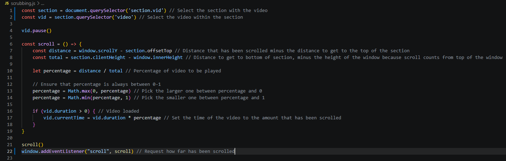
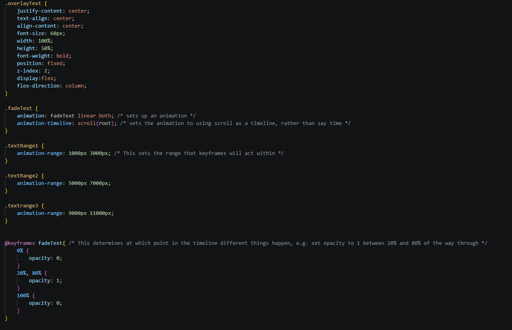

# Title

## Identifying and defining

### Divergent thinking

### Convergent thinking

### Requirements outline

#### Functional requirements

##### Should run with no major transition errors

##### All information must be accurate and researched

#### Non-Functional requirements

##### Animation/video play should be smooth with low performance requirements

##### Site should feel cinematic and high quality

##### Site should be usable and intuitive

## Researching and planning

### Explore existing ideas

| Idea | Plus | Minus | Implication |
| ---- | ---- | ----- | ----------- |
| Getty Persepolis | Extremely informational, overseen by historians to provide relevant information that was found upon excavating persepolis. | Can have performance issues on lower end machines due to the 3d models used in the website. | This project should aim to be fairly similar to Getty Persepolis, using it as a role model to follow, to hopefully increase the quality of the project. |
| Instagram | Very engaging and influential. Instagram spreads ideas, information, and influence, for better and worse. It does this by making its distribution engaging, through short form content that aggressively rewards retention. | Influences both good and bad, high engagement can lead to addiction | Since the website is a once off that won't add any other content post-release, addiction won't be a worry. Therefore the retention and engagement will be a crucial component of the task.
 |
| Wikipedia | Large repository of information. Has a large userbase that is influenced by the information that Wikipedia puts out.  | Because it can be edited easily, it sometimes gets sabotaged. As a result, it has a lowered reputation for information and learning. Additionally, the style of the website is quite bland, leading to low retention.| The project should not be editable by other people, otherwise it risks losing reputation. If the project looks bland, people will get bored quicker, allowing it less time to achieve its aim of educating people about Roman monuments and landmarks. |

### Secondary research  

### Primary research

### UI/UX Design

### Prototype

## Producing and implementing

### Development

### Documentation

#### Development week 1:

| Week (of development) | What was accomplished | What needs to be done next | Misc / Other thoughts | Screenshots / other evidence |
| ---- | ---- | ----- | ----------- |
| 1 | This week I worked on the scroll scrubbing and creating a basic outline of the website, as well as some documentation / research scaffolding. I got the scroll scrubbing to work with javascript, with the help of a youtube video. Regarding videos, I found the main video that I will use for this project, and have been editing it to the size that is needed.| The next step for coding is to figure out how to add text to the pages as you scroll through, which will be the primary method of displaying information. I also need to plan out all of the buildings I will be covering, as there are many I can do in one go, and even more if cuts and transitions are used. | I will have to do much of this at home as the videos I intend to use of Rome are blocked on school wifi. Probably need a scalable model that allows more pages and information done by this weekend, although I don't know how likely that is to happen with the other exams |Youtube video: https://www.youtube.com/watch?v=L1eu737bu70 |
| 2 | This week has included putting text in the website in animation form, allowing it to be tinkered with until it looks cinematic. Also I am almost finished editing the video down into parts that I can put in the website. Plus I have a list of different buildings that I am planning to describe and put in the website. | Next up is transitions between pages and the implementation of the video must be done. |  |
| | | | |

### Version Control

## Testing and evaluating

### Peer evaluation

### Evaluation of issues

#### Social

#### Ethical

#### Legal

### Project evaluation

#### Meeting requirements

#### Project management

#### Impact on target market