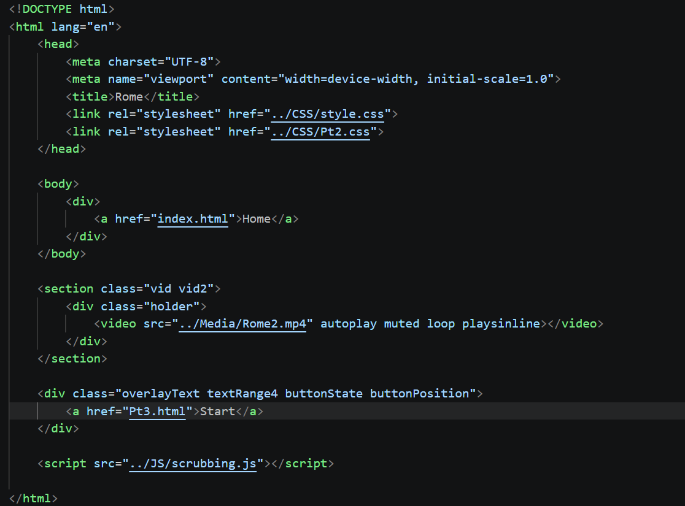
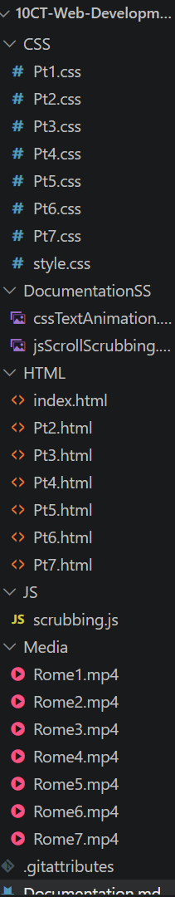
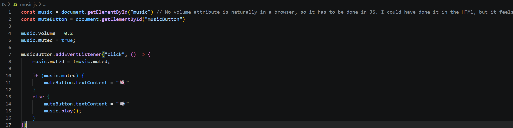

# Title

## Identifying and defining

### Divergent thinking

### Convergent thinking

### Requirements outline

#### Functional requirements

##### Should run with no major transition errors

##### All information must be accurate and researched

##### Should be a scroll website, similar to Getty Persepolis

#### Non-Functional requirements

##### Animation/video play should be smooth with low performance requirements

##### Site should feel cinematic and high quality

##### Site should be usable and intuitive

## Researching and planning

### Explore existing ideas

| Idea | Plus | Minus | Implication |
| ---- | ---- | ----- | ----------- |
| Getty Persepolis | Extremely informational, overseen by historians to provide relevant information that was found upon excavating persepolis. | Can have performance issues on lower end machines due to the 3d models used in the website. | This project should aim to be fairly similar to Getty Persepolis, using it as a role model to follow, to hopefully increase the quality of the project. |
| Instagram | Very engaging and influential. Instagram spreads ideas, information, and influence, for better and worse. It does this by making its distribution engaging, through short form content that aggressively rewards retention. | Influences both good and bad, high engagement can lead to addiction | Since the website is a once off that won't add any other content post-release, addiction won't be a worry. Therefore the retention and engagement will be a crucial component of the task.
 |
| Wikipedia | Large repository of information. Has a large userbase that is influenced by the information that Wikipedia puts out.  | Because it can be edited easily, it sometimes gets sabotaged. As a result, it has a lowered reputation for information and learning. Additionally, the style of the website is quite bland, leading to low retention.| The project should not be editable by other people, otherwise it risks losing reputation. If the project looks bland, people will get bored quicker, allowing it less time to achieve its aim of educating people about Roman monuments and landmarks. |

### Secondary research  

#### Worldwide, according to UNESCO Global Education, upper secondary school completion rates sit at around 61% (year 12). This means that 61% of the year completes upper secondary school each year. And while this is going up, it is slowing down. Which means that there are still many adults from before these relatively high education rates that are still not high school educated. All this is to say that education access or completion rates are not as high as they could be. In contrast, the global digital overview puts individual phone owners at 6.12 billion, as of April 2026. This means that 73.65% of people own a phone worldwide, higher among adults, however a significant amount of children own phones as well. These number when compared show that phone access is comparatively higher than secondary school education access, which is something that my website will attempt to alleviate. 

#### By providing history information and education in an interactive way to people who do not have access to formal education, but do have access to digital technology and the internet, my web app will help relieve this education problem. Because the website will be in english, it will be targeted towards english speaking countries, which already generally have higher completion rates, however even in these countries, phone access is correspondingly higher. 

### Primary research

### UI/UX Design

### Prototype

## Producing and implementing

### Development

### Documentation

#### Development week 1:

| Week (of development) | What was accomplished | What needs to be done next | Misc / Other thoughts | Screenshots / other evidence |
| ---- | ---- | ----- | ----------- |
| 1 | This week I worked on the scroll scrubbing and creating a basic outline of the website, as well as some documentation / research scaffolding. I got the scroll scrubbing to work with javascript, with the help of a youtube video. Regarding videos, I found the main video that I will use for this project, and have been editing it to the size that is needed.| The next step for coding is to figure out how to add text to the pages as you scroll through, which will be the primary method of displaying information. I also need to plan out all of the buildings I will be covering, as there are many I can do in one go, and even more if cuts and transitions are used. | I will have to do much of this at home as the videos I intend to use of Rome are blocked on school wifi. Probably need a scalable model that allows more pages and information done by this weekend, although I don't know how likely that is to happen with the other exams |Youtube video: https://www.youtube.com/watch?v=L1eu737bu70 |
| 2 | This week has included putting text in the website in animation form, allowing it to be tinkered with until it looks cinematic. Also I am almost finished editing the video down into parts that I can put in the website. Plus I have a list of different buildings that I am planning to describe and put in the website. | Next up is transitions between pages and the implementation of the video must be done. |  |
| 3-3.5 (Monday Tuesday Wednesday) | This week all of the framework has been established. I created folders for all of the JS, CSS, and HTML, and ensured it all worked together properly. I cut the videos and put them in the html, and they can be navigated currently. Each of the videos has different heights, corresponding to their length, i.e. vid length x 1000px, although this is subject to change. Fixed performance issues that come from videos by encoding them with ffmpeg in git bash. | Next is the information + buttons, the polish will come later. The information will probably take the form of buttons + basic captions. The buttons can be clicked on to expand information, while basic captions might be the buildings currently in frame. Wednesday: Added most of the points of interests and placeholder (rough) animation ranges in css classes. | The video was very very finicky, some slight mistakes in video editor with fade in / out made me have to redo it multiple times to get it right, i had the fade out not completely covering the video timeline, so after the video faded completely to black, there was a single frame of the Rome video at the end. The encoding took some work, as I had to change the quality to make sure that each video file was under 100mb, or it wouldn't push to github properly. When I added the folders, I had to go through and change every reference in every page. Wednesday: Added most of the points of interests and placeholder (rough) animation ranges in css classes. This afternoon I will make sure to fix the animation ranges and put these in the actual website with html. I want to also make a map screen that shows the overall journey, which checkpoints for each page that are clickable for navigation. Also maybe an 'overarching' view of everything, with information bubbles for big areas of the city like the forums.|  |
| 3.5-4 (Thursday Friday Saturday Sunday) | These days most of the flesh of the website was added. Thursday consisted of adding all of the information/research and tweaking some of the button placements and ranges. It also had favicons (Thanks Adrian). Friday had more tweaking of the buttons. It also added a map to allow a different form of navigations. It had text shadow to show things better, and also animations such as the pulse animation to help with transitions. Saturday had every feature finalised, with the addition of another JS script for music, and a suitable button to accompany it. It also fixed the transitions that were added on Friday, certain issues like the text at the end black showing but not the beginning black. Many comments were added, and the style.css file was organised better. | In terms of production, the website is mostly finished, unless I think of anything that must be done last minute. I am happy to submit in the current state, although there is md work to be done. | There are many other features that could be added, but would take too much time for little benefit. The music in particular, while its cool, it doesn't autoplay once turned on, requiring turning on in each page, which can be a nuisance. But I would need to find a way to store the muted status in JS. Also, I can't think of a way that flask could have been implemented in an appropriate or necessary way for this task, since it is more of an experience than a traditional website that would need to save personal information. | Many of the files are too large to have screenshots showing the whole thing. |

### Version Control

## Testing and evaluating

### Peer evaluation

#### There doesn't seem to be mention of this in the actual rubric... However, this is the feedback I have received over my shoulder:

#### Charles: Said the project looked really good and was impressed. Said that the white text can be hard to read on the busy and bright background. In response I added text shadow to address this problem.

#### Adrian: Came asking to look for... inspiration? examples for structuring html/css? Was really impressed, gave the suggestion to add favicons, the little icon at the top of the website, and helped me with that. I showed him how I structured my code, how classes in divs worked etc.

### Evaluation of issues

#### Social: The website 

#### Ethical: Because the site is designed to seek engagement, the information boxes are quite small, when each box in reality could have several essays written about it. That is, much of the information is heavily condensed, which can create ethical issues on the fair and accurate representation of the various buildings seen throughout the project. Although, the site deals with this by attempting to be as neutral and factual as possible.

#### Legal: This project uses multiple pieces of media that other people have created, however it falls under fair dealing as it is for educational purposes, private, and non commercial, since it will just be shared among people at school. These pieces include the music, made by Kevin Macleod (famously free use), and James Kibbie (free use as long as its not for commercial purposes). The video is a more complicated situation. I use a small amount of History in 3D's 3d modelling videos, transform them by cutting, transitioning, speeding up etc, then put them in the website and add more information. The end result is a heavily transformed selection of clips. They are being used for education, however they cannot be redistributed. It is also heavily inspired by Getty Persepolis in format, however no material itself has been gotten from that website. 

### Project evaluation

#### Meeting requirements

#### Functional Requirements

##### Should run with no major transition errors: Meets this functional requirement, transitions work between pages properly, fade in and out.

##### All information must be accurate and researched: Meets this functional requirement, information is accurate, crosschecked against multiple sources

##### Should be a scroll website, similar to Getty Persepolis: Meets this requirement to an extent. Website is scroll based, however it uses a video as backdrop rather than a 3d model, meaning that there is less freedom on the camera work unfortunately.

#### Non-functional Requirements

##### Animation/video play should be smooth with low performance requirements: Achieves this non-functional requirement, video was encoded with keyframes and preloads, meaning that performance is realistically as good as it can be with the quality of video.

##### Site should feel cinematic and high quality: Somewhat achieves this outcome. There are likely better design choices in terms of buttons and font that could enhance the experience.

##### Site should be usable and intuitive: Achieves this outcome. Everything is clearly labelled, and scroll intention is outlined with an arrow in the very beginning and in every

#### Project management: Project was managed fairly well overall. The idea was in place very early, allowing me to make plans early. I knew this was a very large project, and that it would be difficult to get the same scope as Getty Persepolis, as was my goal. As such, I heavily prioritised the site over other aspects of the project. Although plans were made early, much of the work was done in the final week, in terms of producing the website itself. I believe that some aspects of the site could have been created better, like the information buttons. In the end this prioritisation of the website lead to a rush in other aspects. However, I still believe that it was worth it to make sure the website was fully fleshed out and in a state that I am happy with.

#### Impact on target market: Unfortunately, realistically the project cannot be made available to the target market. Hypothetically, if it could, I believe that the site would have a large impact on those it reached. The engaging style makes it something fairly memorable, maybe the information less so. But I think that after a scroll through the site, one would be able to recognise those buildings, overall increasing their knowledge of ancient Rome. Those that do more than a cursory watch will come away with more knowledge, able to state buildings and purpose / who built them, as well as gain a greater knowledge for the general layout of Rome. Ultimately, I believe that the site would have a large impact on knowledge on Rome on those that it reached within the target market of non-formally educated individuals with internet access. 